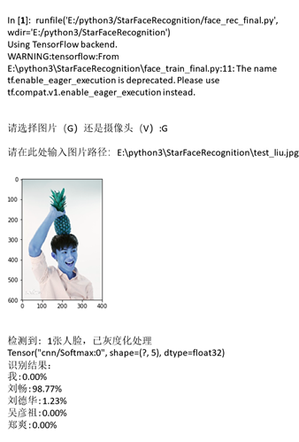

# Face Recognition using the TensorFlow integrated with Keras

*[点击此处阅读中文文档](使用TensorFlow作为后端的Keras实现的简单人脸识别)*

This project finished an easy face recognition, which can recognize certain face from the dataset in nice result.

And this project is just for those who want to know some new knowledges in deep learning to begin.

You can view the final result showing below.

## 1. Firstly, show my thanks for their works

1. *[Python OpenCV+TensorFlow2.0 人脸识别入门](https://blog.csdn.net/qq_41495871/article/details/102886182)*
2. *[Python爬虫——批量爬取微博图片（不使用cookie）](https://blog.csdn.net/weixin_43943977/article/details/102873455)*
3. *[人脸识别开源图片集(刘德华和吴彦祖)](https://blog.csdn.net/andylou_1/article/details/79184580?depth_1-utm_source=distribute.pc_relevant.none-task-blog-BlogCommendFromBaidu-10&utm_source=distribute.pc_relevant.none-task-blog-BlogCommendFromBaidu-10)*

## 2. Instructions for Environment

* **Python = 3.5.6** (*FYI, DEPRECATION: Python 3.5 reached the end of its life on September 13th, 2020. Please upgrade your Python as Python 3.5 is no longer maintained. pip 21.0 will drop support for Python 3.5 in January 2021. pip 21.0 will remove support for this functionality.*)
* **Keras = 2.3.1**
* **TensorFlow_GPU = 1.15.0**
* **CUDA = 10.0, cuDNN = 7.6.5**
* **other toolkits like Dlib, OpenCV, Numpy, matplotlib, PIL**

All this environment may not so important as long as you can run the code.

## 3. Instructions for Datasets

1. Firstly, you should prepare five faces image dataset, and the five faces can be the first four are the certain face with certain persons and the left out face set that we can define it as the other face using lots of other faces.

   In this repository, I prepared the other four pre-processed face image set and you can shoot your face with your computer camera as the fifth face image set.

   Also, you can use other face dataset to do this work, and next I will introduce the face image I catch from weibo and the method to get your own face.

2. Run ***data_weibo.py*** to get the mixed images dataset

3. Run ***data_weibo_process.py*** to get the face image, and then you should delete the unqualified face images like other's face or detected error image.

4. Run ***data_all_prepreocessed.py*** to finish all the dataset preparing and labeled

## 4. Instructions for Training

Run ***face_train_final.py***

## 5. Instructions for Applying

Run ***face_rec_final.py***

**And if you don't want to train this model, you can use the trained model to experience this face recognition, which means that you can run the *face_rec_final.py* directly**

## 6. To Do

Improve the accuracy and do more test.

# 使用TensorFlow作为后端的Keras实现的简单人脸识别

这是一个简单的人脸识别项目，网络简单，同时局限性较多，只是用来深度学习初学者了解人脸识别这样一个过程的项目，下面的最终的结果展示图例。

## 1. 首先，感谢这些作者的工作

1. *[Python OpenCV+TensorFlow2.0 人脸识别入门](https://blog.csdn.net/qq_41495871/article/details/102886182)*
2. *[Python爬虫——批量爬取微博图片（不使用cookie）](https://blog.csdn.net/weixin_43943977/article/details/102873455)*
3. *[人脸识别开源图片集(刘德华和吴彦祖)](https://blog.csdn.net/andylou_1/article/details/79184580?depth_1-utm_source=distribute.pc_relevant.none-task-blog-BlogCommendFromBaidu-10&utm_source=distribute.pc_relevant.none-task-blog-BlogCommendFromBaidu-10)*

## 2. 环境

* **Python = 3.5.6** (*注意，python3.5已经开始慢慢被淘汰，将不会支持目前以及未来更多的更新*)
* **Keras = 2.3.1**
* **TensorFlow_GPU = 1.15.0**
* **CUDA = 10.0, cuDNN = 7.6.5**
* **other toolkits like Dlib, OpenCV, Numpy, matplotlib, PIL**

所有的环境配置都不是最重要的，对于其他库你可以有自己的库，只要你可以运行这些代码，遇到问题，你可以在issue里面提出。

## 3. 数据集

1. 五个文件夹的人脸数据集，在此我已经给出了4个人脸的数据集，最后一个可以是你自己也可以是其他的人脸数据集里面包含着不同的人的人脸。

2. 运行 ***data_weibo.py*** 得到爬取的人脸图片

3. 运行 ***data_weibo_process.py*** 对爬取的图片进行预处理，同时手工筛选不合格的图片

4. 运行 ***data_all_prepreocessed.py*** 给所有图片打上标签

## 4. 训练

运行 ***face_train_final.py***

## 5. 应用

运行 ***face_rec_final.py***

**如果你不想或者是没有办法自己训练这个模型，你可以直接使用model里面已经保存的模型文件来运行 *face_rec_final.py* **

## 6. 待完成

很多很多~